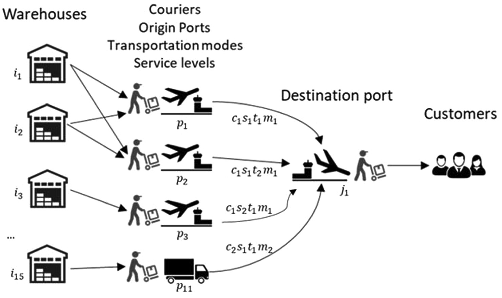

# Análisis de una cadena de suministro (Supply Chain)
## Objetivos
Determinar un conjunto de plantas de almacenaje, puertos de origen y puertos de destino que minimicen el costo total de la cadena de suministro.

## Descripción del proyecto
Se tiene una cadena de suministro formada por 15 plantas de almacenamiento, 11 puertos de orígenes y 1 puerto de destino.  

  

### Primera parte
- Extracción de una base de datos <a href = "https://brunel.figshare.com/articles/dataset/Supply_Chain_Logistics_Problem_Dataset/7558679?file=20162015"> Database </a>.
- Transformación de los datos (eliminación de filas duplicadas, eliminación de valores nulos, etc.)
- Análisis exploratorio de cada tabla de datos.

### Segunda parte
- Modelado de los datos.
- Análisis exploratorio de la tabla resultante.
- Análisis prescriptivo (optimización) y determinación de KPI´s financieros.
- Visualización de los resultados.

 
Lenguaje de Programación utilizado: Python
Librerías: Numpy, Pandas
