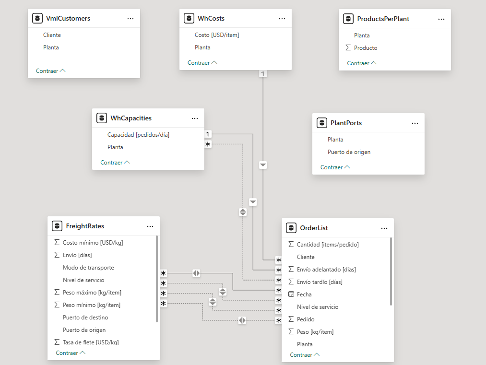

# Análisis de una cadena de suministro (Supply Chain)
## Objetivos
Determinar un conjunto de plantas de almacenaje, puertos de origen y puertos de destino que minimicen el costo total de la cadena de suministro.

## Descripción del proyecto
Se tiene una cadena de suministro formada por 15 plantas de almacenamiento, 11 puertos de orígenes y 1 puerto de destino.  

  

### Primera parte
- Extracción de una base de datos <a href = "https://brunel.figshare.com/articles/dataset/Supply_Chain_Logistics_Problem_Dataset/7558679?file=20162015"> Database </a>.
- Transformación de los datos (eliminación de filas duplicadas, eliminación de valores nulos, etc.)
- Análisis exploratorio de cada tabla de datos.

### Segunda parte
- Modelado de los datos.
- Análisis exploratorio de la tabla resultante.
- Análisis prescriptivo (optimización) y determinación de KPI´s financieros.
- Visualización de los resultados.
 
La base de datos está conformada por 7 tablas en un archivo de Excel. A su vez,
 
Tablas de hechos: Fletes, Pedidos.
Tablas de dimensiones: Clientes, Productos por Planta, Puertos de origen, Capacidades, Costos de Almacenaje
 
Sin embargo, algunas tablas de dimensiones son redundantes, es decir, que son necesarias incluir en el modelo de datos (como en el caso de las tablas Clientes y Productos por Planta) ya que la misma información está contenida en las tablas de hechos.

  

 
Lenguaje de Programación utilizado: Python
 
Librerías: Numpy, Pandas
